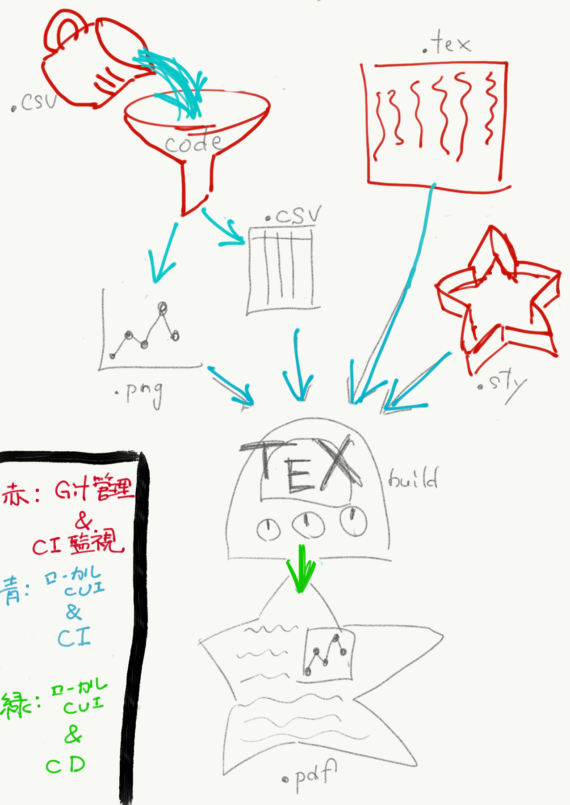

# CITeX

業務 & 研究現場におけるドキュメント生成を効率化するため
- CI（継続的インテグレーション）
- CD（継続的デプロイ）
環境を構築するプロジェクト

## 対象とするドキュメント
以下の特徴のいずれかに当てはまる文書
- 複数人で執筆する
- 毎年発行される
- 見出しがある
要は，よほどのことがない限り，全ての文書は CI & CD 化されるべき．

## 計画
https://github.com/kikirinrin/CITeX/projects を参照

## 環境構築
### Docker 環境の構築
貢献してくださる方は，[Wiki](https://github.com/kikirinrin/CITeX/wiki) を見ながらチャレンジして下さい．

Wiki の説明に足りないところがあると思いますので，適宜編集してくださると大変助かります．
### pdf ビューアの導入
編集 & 確認を可能にするために，自動リロード機能のある pdf ビューアをご準備下さい（Windows なら Sumatra PDF？）
Windows 10 で Acrobat pdf を開いたままコンパイルを試みたところ，エラーになりました．

## ワークフロー
1. `./manuscript.txt` を編集する
1. `docker-compose run --rm latexmk manuscript.tex` を実行
1. PDF を開いて確認（unix 環境なら `docker-compose run --rm latexmk manuscript.tex && open manuscript.pdf` 一発でOKです）
1. 必要に応じて `./manuscript.txt` を再編集する（以下繰り返し）

### Tips
`*.dvi` や `*.aux` などの中間ファイルが邪魔になった場合には
`git clean -f`
で削除できます．
